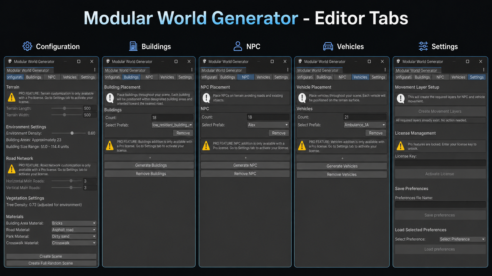
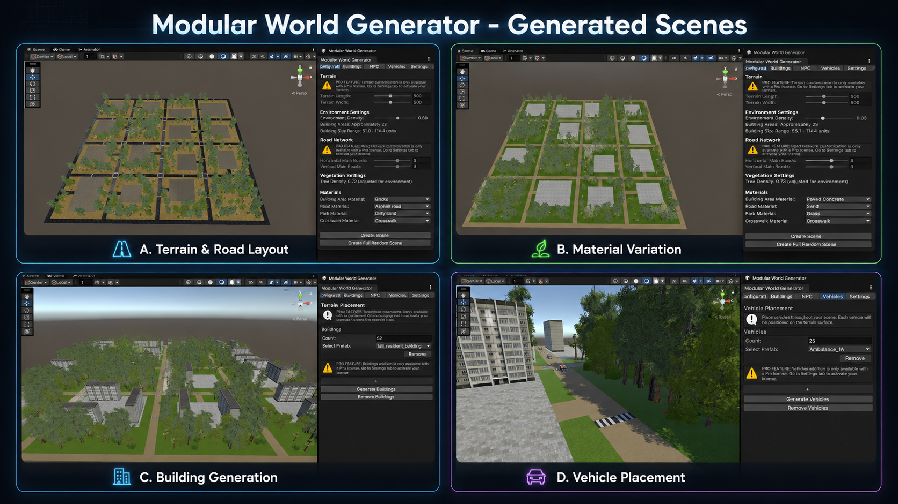
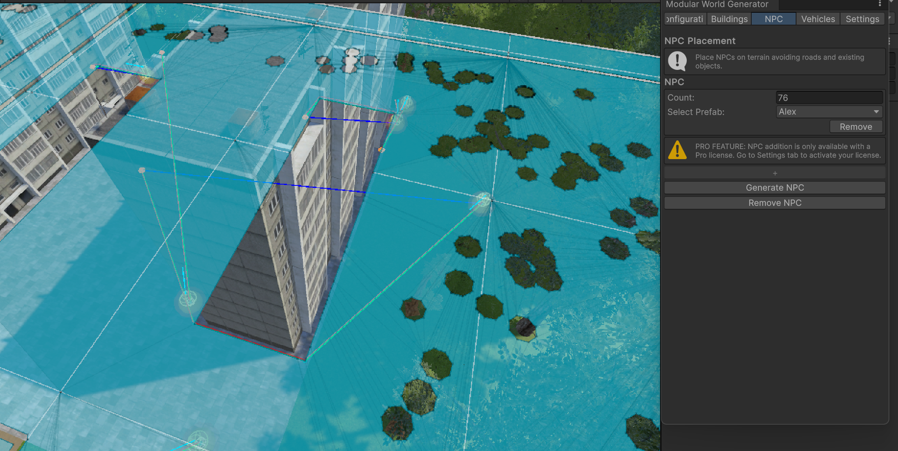
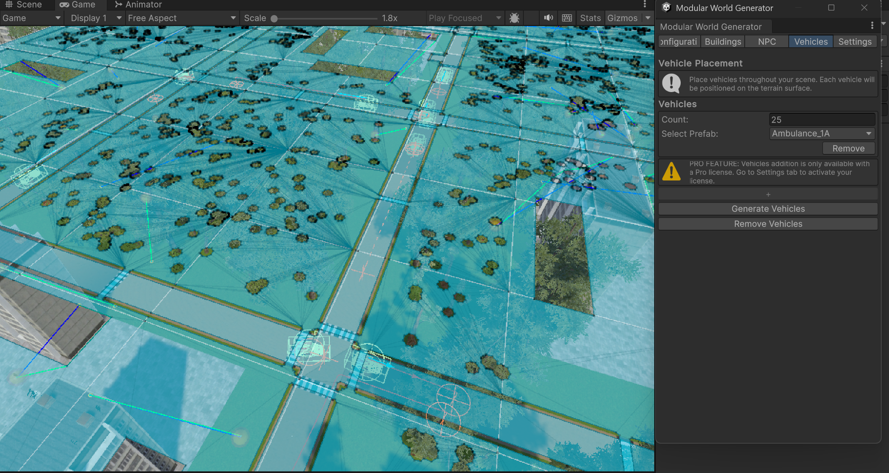
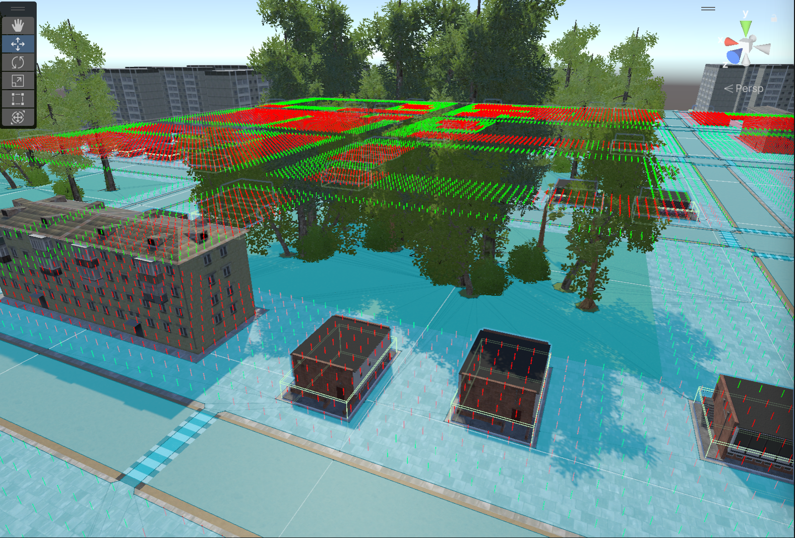
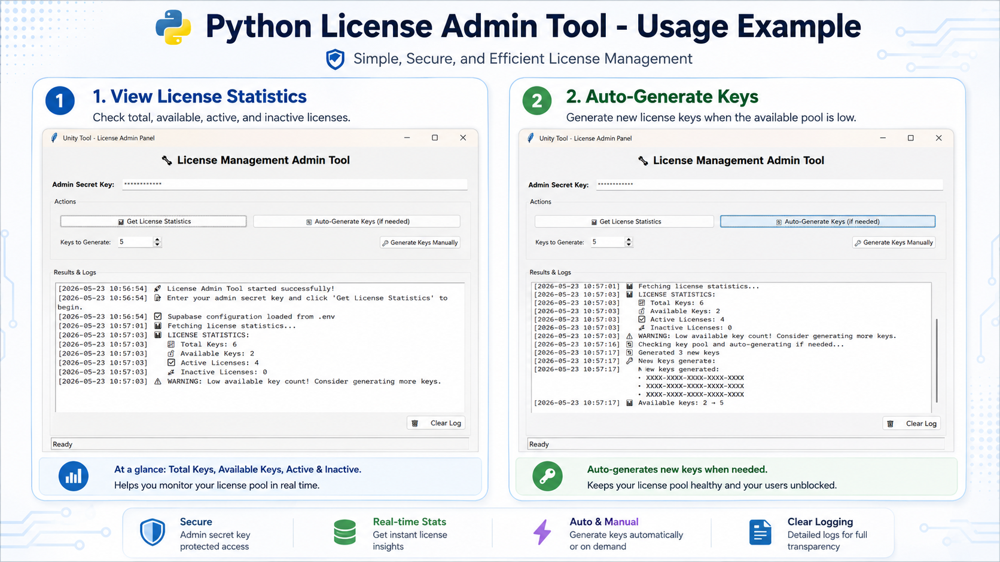
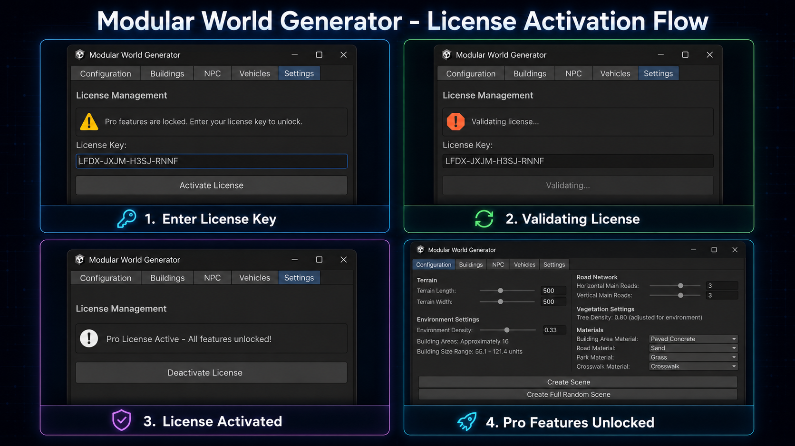
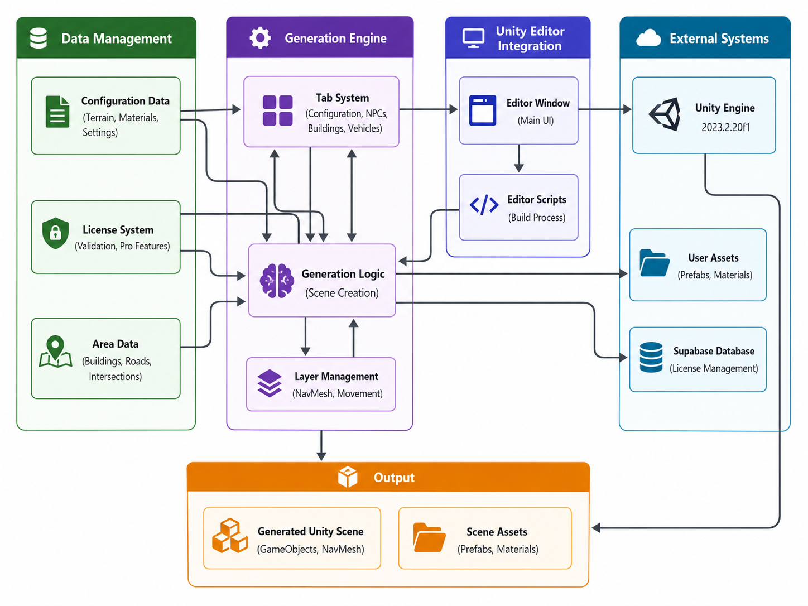

> **A Unity Editor tool for fast, structured, procedural scene generation**
> _“A happy player starts with a much happier developer.”_

---

# 🌍 **Modular World Generator**

The **Modular World Generator** is a Unity Editor tool designed to **rapidly create full, game-ready scenes** — including terrain, buildings, roads, NPCs, vehicles, foliage, and navigation systems.
Unlike typical world-building tools that generate only terrain or vegetation, this tool provides **complete scene generation** with **intuitive controls**, **editor integration**, and **scalable licensing**.

This repository contains the full source code, editor scripts, algorithms, and documentation from the final B.Sc. Computer Science project by **Ben Lachovitz** and **Guy Zvilich**.

---

# 🎯 **Table of Contents**

1. [Overview](#overview)
2. [Key Features](#key-features)
3. [Screenshots](#screenshots)
4. [How It Works](#how-it-works)
5. [System Architecture](#system-architecture)
6. [Generation Algorithm](#generation-algorithm)
7. [Installation](#installation)
8. [Usage Guide](#usage-guide)
9. [Pro License System](#pro-license-system)
10. [Performance Benchmarks](#performance-benchmarks)
11. [Limitations](#limitations)

---

# 🔍 **Overview**

Modern game development demands fast iteration and efficient content creation.
This tool solves that need by offering:

- Full-scene procedural generation
- A clean & simple Unity Editor interface
- Configurable world parameters
- Randomization _within_ logical constraints
- Grid-based placement for clean and realistic scenes
- Integrated navigation for NPCs and vehicles
- Cloud-based PRO licensing using **Supabase**

This makes it ideal for:

- Prototyping levels
- Generating multiple scene variations
- Indie developers without large art teams
- Students and researchers studying procedural generation

---

# 🚀 **Key Features**

### **🧭 Procedural Scene Generation**

- Terrain sizing
- Horizontal & vertical roads
- Parks & greenery
- Buildings, trees, props

### **👥 Population Generation**

- NavMesh-driven NPCs
- Vehicle agents with movement logic
- Automatic NavMesh baking

### **🎛 User-Friendly Unity Editor Tool**

- EditorWindow interface
- Sliders, toggles, dropdowns
- Regenerate/Clear buttons
- Real-time preview of settings

### **📦 Modular Architecture**

- Separated modules:
  - Grid generator
  - Placement engine
  - NavMesh handler
  - Asset manager
  - License validator

### **🔐 Supabase Licensing (Pro Version)**

- Key activation
- Auto-revalidation every 10 minutes
- Admin tool (Python GUI) for issuing keys
- Locks/unlocks advanced features

---

# 🖼 **Screenshots**

### **Editor Window**



### **Generated Scene – Buildings & Roads**



### **NPC Navigation Preview**



### **Vehicle Paths**



### **Grid Layout Visualization**



### **License Admin Tool**



### **License Activation Flow**



---

# ⚙️ **How It Works**

The generator follows a **structured grid-based pipeline**:

1. **Terrain Setup**
2. **Road Generation (horizontal/vertical)**
3. **Grid Cell Partitioning**
4. **Asset Placement (with spacing & logic)**
5. **NavMesh Build**
6. **Population Spawning**
7. **Validation Pass**

This ensures scenes are both:

- Visually coherent
- Logically structured
- Stable for gameplay

---

# 🧩 **System Architecture**

### **🟦 Editor Layer**

- Handles user input
- Displays tool UI
- Sends parameters to generation engine

### **🟩 Logic Layer**

- GridGenerator
- PlacementEngine
- NavigationHandler
- AssetManager

### **🟪 Backend Layer**

- Supabase key validation
- HTTP requests via UnityWebRequest

---

### **📐 Architecture Diagram Placeholder**



---

# 📁 Repository Structure

```txt
Modular-World-Generator/
├── ModularWorldGenerator - Unity/     # Main Unity Editor tool
├── LicenseAdminTool - Python/         # Python admin tool for license management
├── Supabase/                          # Supabase Edge Functions and database scripts
├── docs/                              # Project documentation
├── images/                            # README screenshots and diagrams
├── README.md                          # Main project overview
└── .gitignore
```

---

# 🧠 **Generation Algorithm**

### **1. Road-Based Grid Creation**

- Roads divide the terrain into structured cells
- Prevents chaotic or overlapping layouts

### **2. Placement Logic**

- Buildings → building cells
- NPCs → walkable areas
- Vehicles → roads
- Trees → parks

Rules ensure spacing and alignment:

```txt
- No overlaps
- Respect boundaries
- Align to grid axes
- Randomized position offset
```

### **3. Navigation System**

- NavMesh baked after placement
- NPCs use roaming / idle / patrol
- Vehicles follow custom paths

---

# 📥 **Installation**

### **Requirements**

- Unity **2023.2.20f1** or later
- .NET Framework compatible with Unity
- Internet connection (for PRO license features)

### **Clone the Repository**

```bash
git clone https://github.com/BenLachovitz/Modular-World-Generator.git
cd Modular-World-Generator
```

### **Steps**

1. Clone the repository
2. Open Unity → select project folder
3. Navigate to:
   **Tools → Modular World Generator**
4. Start generating scenes instantly

---

# 🕹 **Usage Guide**

### **1. Open the Tool**

Inside Unity:

```
Window → Tools → Modular World Generator
```

### **2. Set Your Parameters**

- Terrain size
- Road density
- Building count
- NPC count
- Vehicle count
- Materials
- Presets

### **3. Click Generate**

The tool will:

- Build the terrain
- Draw roads
- Place assets
- Bake NavMesh
- Spawn NPCs & vehicles

### **4. Need a new variation?**

Click **Regenerate Scene**
→ All new placements
→ New randomness
→ Same constraints

---

# 🛠 **Technology Stack**

| Area              | Technology                           |
| ----------------- | ------------------------------------ |
| Game Engine       | Unity 2023.2.20f1                    |
| Main Language     | C#                                   |
| Editor Tooling    | Unity EditorWindow / EditorGUILayout |
| Navigation        | Unity NavMesh                        |
| Backend           | Supabase                             |
| Backend Functions | Supabase Edge Functions / TypeScript |
| Admin Tool        | Python / Tkinter                     |
| Networking        | UnityWebRequest                      |
| Version Control   | Git / GitHub                         |

---

# 🔐 **Pro License System**

The tool includes a cloud-based licensing system using **Supabase**.

### **Pro Features Include**

- Full-scene automatic generation
- Preset saving & loading
- Batch generation
- Extended asset categories

### **How It Works**

1. User enters license key
2. Unity sends an HTTPS request to Supabase
3. Key is validated through a Supabase Edge Function, which communicates with the license database server-side.
4. Rechecked every 10 minutes

### **Admin Tool (Python)**

- Issue keys
- Revoke keys
- Monitor usage & activation

---

# ⚡ **Performance Benchmarks**

| Operation               | Target   | Achieved  |
| ----------------------- | -------- | --------- |
| Manual Scene Generation | ≤ 2 sec  | ~1 sec    |
| Full Random Scene       | ≤ 40 sec | 20–30 sec |
| License Validation      | ≤ 3 sec  | 1–2 sec   |
| Save/Load Settings      | ≤ 2 sec  | ~1 sec    |

---

# ⚠️ **Limitations**

- Asset quality depends on user's prefab library
- Designed only for **Unity**, not Unreal/Godot
- Complex scenes may hit memory limits on low-end PCs
- Dynamic runtime regeneration not yet supported
